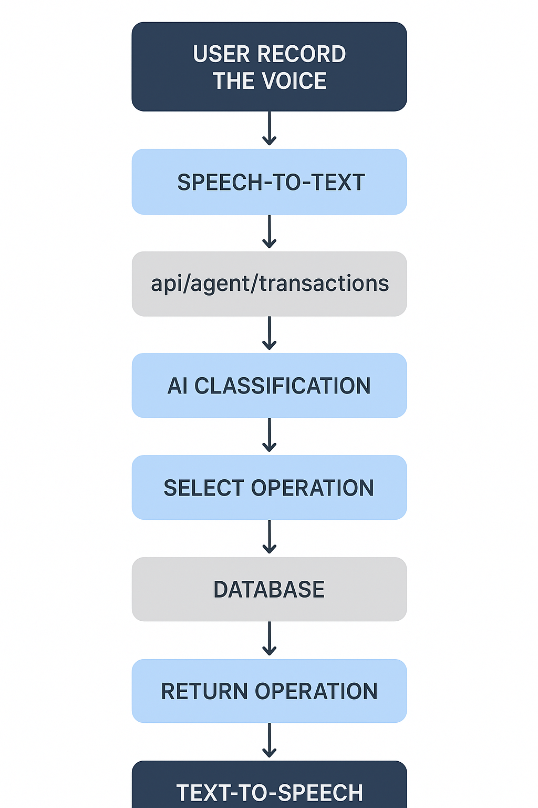
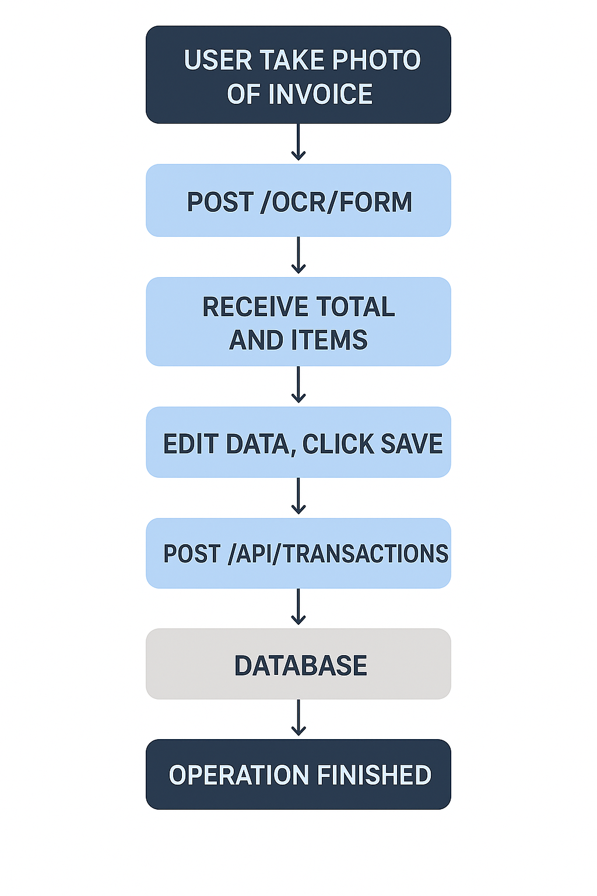

# Jagawarung Monorepo 🏪

<div align="center"></div>

A comprehensive business management system for Indonesian small businesses (UMKM) consisting of a Flutter mobile application with voice-first capabilities and a Node.js backend API.

## 📖 Contents

- [Features](#-main-features-data-flow)
- [Repository Structure](#-repository-structure)
- [Components](#-components)
  - [Backend (Node.js/TypeScript)](#backend-nodejstypeScript)
  - [Mobile (Flutter)](#mobile-flutter)
- [Tech Stack](#️-tech-stack)
- [Getting Started](#-getting-started)
  - [Prerequisites](#prerequisites)
  - [Backend Setup](#2-backend-setup)
  - [Mobile Setup](#3-mobile-setup)
- [Key Features](#️-key-features)
- [API Endpoints](#-api-endpoints)
- [Updating Submodules](#-updating-submodules)
- [Development Workflow](#️-development-workflow)
- [Contributing](#-contributing)
- [Support](#-support)
- [Acknowledgments](#-acknowledgments)

## 🌟 Main Features Data Flow

### Voice-Based Transaction Management

Our app makes managing your business transactions as easy as speaking! Simply talk to your phone in natural Indonesian, and the app will understand and record your transactions automatically.

<div align="center"></div>

#### What You Can Do With Voice Commands:

1. **Record Expenses** - Just say "Pengeluaran 50 ribu" and the app will log your expense
2. **Track Income** - Say "Pemasukan 200 juta" to record your earnings
3. **Manage Debts** - "Budi hutang 100 ribu" creates a debt record for Budi
4. **Mark Debts as Paid** - "Budi lunas" clears Budi's debt automatically
5. **Update Existing Debts** - "Andi hutang 50 ribu" adds to Andi's existing debt

#### How It Works:

1. **You Speak** - Press the microphone button and speak naturally in Indonesian
2. **AI Understands** - Our smart AI analyzes your words and identifies what you want to do
3. **Action Taken** - The app automatically records the transaction in the right category
4. **Confirmation** - You get immediate feedback that your transaction was saved

The app understands Indonesian names, common prefixes like "Pak" or "Bu", and various ways of expressing amounts ("50 ribu", "100rb", "1.5 juta").

### Receipt Scanning with OCR

<div align="center"></div>

Tired of typing in receipt details? Just snap a photo!

#### How It Works:

1. **Take a Photo** - Point your camera at any shopping receipt
2. **AI Reads It** - Our OCR technology extracts all the important information
3. **Smart Categorization** - The app automatically identifies expenses and amounts
4. **Review & Confirm** - Make any quick edits if needed, then save

This feature saves you time and reduces errors when recording multiple expenses from shopping trips.


## 📁 Repository Structure

This is a monorepo containing two main submodules:

```
jagawarung-monorepo/
├── backend/              # Node.js/TypeScript backend API
├── mobile/               # Flutter mobile application
├── .gitmodules           # Git submodule configuration
└── update-submodules.sh  # Script to update all submodules
```

## 🚀 Components

### Backend (Node.js/TypeScript)
- **Location**: `backend/` (submodule: [jagawarung-backend](https://github.com/Juara-1/jagawarung-backend.git))
- **Tech Stack**: Node.js, TypeScript, Express, Supabase, OpenAI-compatible AI
- **Purpose**: RESTful API handling business logic, data persistence, and AI integrations
- **Key Features**:
  - Transaction management (earnings, spending, debts)
  - AI agent endpoint with function calling
  - Supabase integration for database and authentication
  - Comprehensive API with proper error handling

### Mobile (Flutter)
- **Location**: `mobile/` (submodule: [jagawarung](https://github.com/Juara-1/jagawarung.git))
- **Tech Stack**: Flutter 3, GetX architecture, Supabase auth, Gemini AI
- **Purpose**: Voice-first POS system for shop management
- **Key Features**:
  - Voice agent for transactions (Sundanese → Javanese → Indonesian)
  - Dashboard with daily summaries
  - Debt management per customer
  - OCR for expense scanning via Kolosal AI
  - Multi-language TTS support

## 🛠️ Tech Stack

### Backend
- **Runtime**: Node.js
- **Language**: TypeScript
- **Framework**: Express.js
- **Database**: Supabase (PostgreSQL)
- **AI**: OpenAI-compatible API (Kolosal AI)
- **Authentication**: Supabase Auth

### Mobile
- **Framework**: Flutter 3
- **State Management**: GetX
- **Architecture**: Clean Architecture
- **HTTP Client**: Dio
- **Speech**: speech_to_text, flutter_tts
- **AI**: Gemini (voice parsing), Kolosal (OCR)
- **Authentication**: Supabase Auth

## 🚀 Getting Started

### Prerequisites
- Node.js (for backend)
- Flutter SDK (for mobile)
- Git (for submodule management)

### 1. Clone the Repository with Submodules

```bash
git clone --recurse-submodules https://github.com/Juara-1/jagawarung-monorepo.git
cd jagawarung-monorepo
```

If you already cloned without submodules:
```bash
git submodule update --init --recursive
```

### 2. Backend Setup

Navigate to the backend directory:
```bash
cd backend
```

Install dependencies:
```bash
npm install
```

Configure environment variables:
```bash
cp .env.example .env
# Edit .env with your Supabase and AI provider credentials
```

Start the development server:
```bash
npm run dev
```

### 3. Mobile Setup

Navigate to the mobile directory:
```bash
cd mobile
```

Install dependencies:
```bash
flutter pub get
```

Configure environment variables:
```bash
# Create .env file in the mobile directory
# Add your API keys (see mobile/README.md for details)
```

Run the application:
```bash
flutter run
```

## 📱 Key Features List

### Voice-First Transaction Management
- Siri/Assistant-like mic button for voice commands
- Automatic parsing of earnings, spending, and debts
- Multi-language TTS support with intelligent fallback

### Comprehensive Dashboard
- Daily summaries of income, expenses, and debts
- Recent transaction list
- Interactive voice input with pulse animation

### Debt Management
- Customer-specific debt tracking
- Voice-based debt recording
- Easy repayment tracking with automatic income conversion

### OCR Integration
- Scan shopping receipts via Kolosal AI
- Automatic expense categorization
- Edit and confirm scanned amounts

## 🔌 API Endpoints

### Transaction Management
- `POST /api/agent/transactions` - Voice agent transactions
- `POST /api/transactions?upsert=true` - Create/update transactions
- `POST /api/transactions/{id}/repay` - Mark debt as paid
- `GET /api/transactions` - List transactions with filtering
- `GET /api/transactions/summary` - Get transaction summaries

## 🔄 Updating Submodules

To update all submodules to their latest versions:
```bash
./update-submodules.sh
```

Or manually:
```bash
git submodule update --remote
```

## 🧭 Development Workflow

1. **Backend Changes**: Navigate to `backend/` and make changes
2. **Mobile Changes**: Navigate to `mobile/` and make changes
3. **Commit Strategy**: Commit submodule changes separately from monorepo changes
4. **Testing**: Test backend and mobile independently before integration

## 🤝 Contributing

1. Fork the repository
2. Create a feature branch
3. Make your changes in the appropriate submodule
4. Test thoroughly
5. Submit a pull request

### Code Style Guidelines
- **Backend**: Follow TypeScript/Node.js best practices
- **Mobile**: 2 spaces indentation, camelCase, comment non-trivial logic only

## 📝 License

This project is licensed under the MIT License - see the LICENSE file for details.

## 🆘 Support

For issues and questions:
- Backend-specific issues: Open in the [backend repository](https://github.com/Juara-1/jagawarung-backend/issues)
- Mobile-specific issues: Open in the [mobile repository](https://github.com/Juara-1/jagawarung/issues)
- Monorepo-specific issues: Open in this repository

## 🌟 Acknowledgments

- Supabase for providing the backend-as-a-service platform
- Gemini AI for voice command processing
- Kolosal AI for OCR capabilities
- Flutter team for the cross-platform framework
